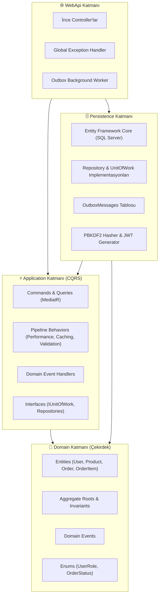

# 🏛️ DotnetArchitecture

Kurumsal standartlarda geliştirilmiş, **Clean Architecture**, **Domain-Driven Design (DDD)** ve **CQRS** prensiplerini uygulayan modern bir **.NET 10** web API referans mimarisidir.

[](https://dotnet.microsoft.com/)
[](https://docs.microsoft.com/en-us/dotnet/csharp/)
[](https://docs.microsoft.com/ef/core/)
[](https://github.com/jbogard/MediatR)
[](https://hub.docker.com/_/microsoft-mssql-server)
[](https://github.com/)
[](LICENSE)

---

## 📑 İçindekiler
- [Mimari Genel Bakış](#-mimari-genel-bakış)
- [Katmanlar ve Teknolojiler](#-katmanlar-ve-kullanılan-teknolojiler)
- [Öne Çıkan Kurumsal Desenler](#-öne-çıkan-kurumsal-desenler)
  - [1. MediatR Pipeline Turnikeleri (Chain of Responsibility)](#1-mediatr-pipeline-turnikeleri-chain-of-responsibility)
  - [2. Transactional Outbox Pattern & Background Worker](#2-transactional-outbox-pattern--background-worker)
  - [3. Veritabanı Düzeyinde Sayfalama, Sıralama ve Filtreleme](#3-veritabanı-düzeyinde-sayfalama-sıralama-ve-filtreleme)
  - [4. JWT Kimlik Doğrulama & Rol Yetkilendirme (RBAC)](#4-jwt-kimlik-doğrulama--rol-yetkilendirme-rbac)
  - [5. Standart Hata Yönetimi (RFC 7807 / 9110 ProblemDetails)](#5-standart-hata-yönetimi-rfc-7807--9110-problemdetails)
  - [6. Specification Pattern (ISpecification ve Evaluator)](#6-specification-pattern-ispecification-ve-evaluator)
  - [7. Canlılık ve Hazırlık Sağlık Denetimleri (Health Checks)](#7-canlılık-ve-hazırlık-sağlık-denetimleri-health-checks)
  - [8. Dahili İstek Sınırlama (Rate Limiting - RFC 6585)](#8-dahili-istek-sınırlama-rate-limiting---rfc-6585)
- [🧪 Otomatik Test Mimarisi (Unit & Integration Tests)](#-otomatik-test-mimarisi-unit--integration-tests)
- [Proje Dizin Yapısı](#-proje-dizin-yapısı)
- [Kurulum ve Çalıştırma](#-kurulum-ve-çalıştırma)
- [API Test Senaryoları (.http Dosyası)](#-api-test-senaryoları-http-dosyası)

---

## 🧭 Mimari Genel Bakış

Proje, bağımlılıkların yalnızca içe doğru aktığı **Onion / Clean Architecture** prensibine dayanır. Domain katmanı en merkezdedir ve hiçbir dış kütüphaneye veya veritabanı aracına bağımlı değildir.



---

## 🏗️ Katmanlar ve Kullanılan Teknolojiler

| Katman | Sorumluluk ve Teknolojiler |
| :--- | :--- |
| **🧠 Domain** | Saf C#, Rich Domain Model, Aggregate Root (`Order`), Domain Events (`OrderCreatedDomainEvent`), Enums (`UserRole`, `OrderStatus`), Encapsulation ve İş Kuralları (Invariants). Dış bağımlılık içermez. |
| **⚡ Application** | CQRS Mimarisi (Commands & Queries), MediatR, DTO Sınıfları, Pipeline Turnikeleri (`PerformanceBehavior`, `CachingBehavior`, `ValidationBehavior`), FluentValidation, `PagedResponse<T>` ve Arayüzler (`IUnitOfWork`, `IProductRepository`, `IUserRepository` vb.). |
| **🗄️ Persistence** | Entity Framework Core, SQL Server Express (Docker), Fluent API Varlık Konfigürasyonları, Repository Pattern, Unit of Work, Transactional Outbox Tablosu (`OutboxMessages`), PBKDF2 Şifreleme ve JWT Token Üretici. |
| **🌐 WebApi** | İnce Controller'lar (`AuthController`, `ProductsController`, `OrdersController`), Scalar UI & OpenAPI Dokümantasyonu, `IExceptionHandler` ile RFC 7807/9110 `ProblemDetails` hata formatı, JWT Bearer Yetkilendirme ve `ProcessOutboxMessagesBackgroundService` (Hosted Service). |

---

## 🌟 Öne Çıkan Kurumsal Desenler

### 1. MediatR Pipeline Turnikeleri (Chain of Responsibility)
Tüm istekler (Command ve Query) Handler'a ulaşmadan önce zincirleme turnikelerden geçer:

```text
HTTP İstek
   │
   ▼
[ Turnike 1: PerformanceBehavior ] ──► Kronometreyi başlatır. İşlem 500 ms'yi aşarsa uyarı loglar.
   │
   ▼
[ Turnike 2: CachingBehavior ] ─────► İstek 'ICacheableQuery' ise önce önbelleğe bakar (Cache HIT: 1 ms).
   │                                   İstek 'ICacheInvalidator' ise işlem bitince ilgili önbellekleri temizler.
   ▼
[ Turnike 3: ValidationBehavior ] ──► FluentValidation kurallarını denetler. Hatalıysa DB'ye gitmeden 400 döner.
   │
   ▼
[ Handler ] ─────────────────────────► İş mantığı ve veritabanı operasyonu çalışır.
```

### 2. Transactional Outbox Pattern & Background Worker
Veritabanına kayıt atarken aynı anda e-posta veya bildirim göndermenin yarattığı **Dual-Write** riskini ortadan kaldırır:
- **Tek Transaction:** Sipariş oluşturulduğunda `Order`, `OrderItems`, stok güncellemesi ve `OrderCreatedDomainEvent` JSON'ı **tek bir SQL transaction'ı** içinde `OutboxMessages` tablosuna yazılır. İstemciye anında `200 OK` dönülür (~15-25 ms).
- **Garantili Dağıtım (At-Least-Once Delivery):** Arka planda çalışan `ProcessOutboxMessagesBackgroundService` kuyruktan işlenmemiş olayları okur, MediatR üzerinden dinleyicilere (E-posta, Depo ERP) iletir ve mesajı `ProcessedOnUtc` olarak işaretler. Ağ veya servis kesintilerinde veri ve bildirim kaybı sıfıra iner.

### 3. Veritabanı Düzeyinde Sayfalama, Sıralama ve Filtreleme
- Bellek tüketimini önlemek amacıyla EF Core `Skip()` ve `Take()` kullanılarak SQL Server üzerinde doğrudan **`OFFSET / FETCH NEXT`** sorguları çalıştırılır.
- İstemciye yalnızca filtrelenmiş veriler değil; `TotalCount`, `TotalPages`, `HasPreviousPage`, `HasNextPage` gibi zengin sayfalama üst verilerini içeren `PagedResponse<T>` döndürülür.
- Parametrelere özel dinamik cache anahtarları (`products-p1-s10-qApple-byprice-descTrue`) ile yüksek performans sağlanır.

### 4. JWT Kimlik Doğrulama & Rol Yetkilendirme (RBAC)
- **Kriptografik Güvenlik:** Şifreler `Rfc2898DeriveBytes.Pbkdf2` algoritmasıyla 100.000 iterasyon ve rastgele 128-bit kriptografik tuz (salt) ile hash'lenir. Zamanlama saldırılarına karşı `FixedTimeEquals` koruması mevcuttur.
- **Rol Koruması:** `[Authorize(Roles = "Admin")]` ile ürün ekleme gibi kritik operasyonlar korunur; `[Authorize]` ile sipariş işlemleri sadece oturum açmış kullanıcılara açılır.

### 5. Standart Hata Yönetimi (RFC 7807 / 9110 ProblemDetails)
- `IExceptionHandler` arayüzü ile merkezi ve güvenli hata yakalama.
- Validasyon hataları, iş kuralı ihlalleri (`InvalidOperationException`) ve bulunamadı durumları standart `application/problem+json` formatında döndürülür.

### 6. Specification Pattern (ISpecification ve Evaluator)
Repository arayüzlerini yüzlerce özel sorgu metoduyla (`GetByNameAndPriceAndCategory...`) kirletmek yerine, sorgu mantığını (Filtre, Eager Loading `Include`, Sıralama ve Sayfalama) kapsülleyen **Domain-Driven Design (DDD)** deseni:
- **`ISpecification<T>` & `BaseSpecification<T>`:** Filtre (`Criteria`), sıralama (`OrderBy`, `OrderByDescending`), ilişkiler (`Includes`) ve sayfalama (`Skip`, `Take`) kurallarını güçlü tipli nesneler halinde tanımlar (örn: `ProductsFilterSpecification`, `OrderWithItemsSpecification`).
- **`SpecificationEvaluator<T>`:** EF Core sorgu ağacını (`IQueryable<T>`) arka planda dinamik olarak inşa eder; EF Core detaylarının Application veya Controller katmanına sızmasını (leak) engeller.
- **Test Edilebilirlik:** Sorgu kuralları veritabanına gerek duymadan saf C# fonksiyonları gibi birim testlerine tabi tutulabilir.

### 7. Canlılık ve Hazırlık Sağlık Denetimleri (Health Checks)
Cloud-native, Kubernetes ve Docker orkestrasyon standartlarına tam uyumlu yerleşik sağlık kontrolü uç noktaları:
- **`/health` (Kapsamlı JSON Sağlık Raporu):** API ve SQL Server bağlantı durumunu, her bir bileşenin milisaniye cinsinden gecikmesini ve hata detaylarını döndürür (`HealthCheckResponseWriter`).
- **`/health/live` (Liveness Probe):** Yalnızca API sürecinin ayakta olup olmadığını denetler (Yanıt: `Healthy`). Süreç çökerse orkestratör konteyneri yeniden başlatır.
- **`/health/ready` (Readiness Probe):** SQL Server veritabanına sorgu atabilirliğini denetler (`AddDbContextCheck<AppDbContext>`). Veritabanı yanıt vermiyorsa yük dengeleyici (Load Balancer) bu instance'a istek yönlendirmeyi geçici olarak durdurur.

### 8. Dahili İstek Sınırlama (Rate Limiting - RFC 6585)
.NET 10 yerleşik `Microsoft.AspNetCore.RateLimiting` middleware'i ile API uç noktaları kaba kuvvet (Brute-Force) ve DoS saldırılarına karşı korunur:
- **`AuthPolicy` (Sıkı Güvenlik):** `/api/auth/login` ve `/api/auth/register` uç noktalarında IP başına 1 dakikada maksimum **10 istek** (Kuyruk: 0). Parola deneme botlarını anında durdurur.
- **`GeneralPolicy` (Kaynak Koruma):** Genel API uç noktalarında (`Products`) IP başına 1 dakikada maksimum **100 istek**.
- **Özelleştirilmiş 429 Yanıtı:** Limit aşıldığında istemciye standart `Retry-After: 60` HTTP başlığı ve RFC 7807/9110 `application/problem+json` formatında hata mesajı döndürülür.

---

## 🧪 Otomatik Test Mimarisi (Unit & Integration Tests)

Projede katmanların bağımsızlığını ve güvenilirliğini garanti altına alan **34 adet otomatik test** bulunmaktadır (`xUnit`, `FluentAssertions`, `NSubstitute` ve `WebApplicationFactory`):

```text
Test Projeleri Dağılımı:
├── 🧠 DotnetArchitecture.Domain.UnitTests      (10 Test) -> Varlık kuralları, stok düşme, Domain Events
├── ⚡ DotnetArchitecture.Application.UnitTests (13 Test) -> CQRS Handler'ları, Specification kuralları, Validation turnikeleri
└── 🌐 DotnetArchitecture.IntegrationTests     (11 Test) -> WebApplicationFactory + InMemory DB (Auth, RBAC, HealthChecks, RateLimiting)
```

Tüm testleri tek komutla koşturmak için:
```bash
dotnet test
```

Örnek Test Çıktısı:
```text
Passed!  - Failed: 0, Passed: 10, Skipped: 0 - DotnetArchitecture.Domain.UnitTests.dll (80 ms)
Passed!  - Failed: 0, Passed: 13, Skipped: 0 - DotnetArchitecture.Application.UnitTests.dll (136 ms)
Passed!  - Failed: 0, Passed: 11, Skipped: 0 - DotnetArchitecture.IntegrationTests.dll (980 ms)

Toplam 34 Testin 34'ü de BAŞARILI! ✅
```

---

## 📁 Proje Dizin Yapısı

```text
DotnetArchitecture/
├── src/
│   ├── DotnetArchitecture.Domain/           # Çekirdek Domain Katmanı
│   │   ├── Common/                         # BaseEntity, IDomainEvent
│   │   ├── Entities/                       # User, Product, Order, OrderItem
│   │   └── Enums/                          # UserRole, OrderStatus
│   │
│   ├── DotnetArchitecture.Application/      # CQRS & İş Mantığı Katmanı
│   │   ├── Behaviors/                      # Performance, Caching, Validation Turnikeleri
│   │   ├── Common/                         # PagedResponse<T>, Specifications (ISpecification, BaseSpecification)
│   │   ├── Features/
│   │   │   ├── Auth/                       # Register, Login (Commands, DTOs, Validators)
│   │   │   ├── Products/                   # CreateProduct, GetAllProducts, Specifications
│   │   │   └── Orders/                     # CreateOrder, GetOrderById, Outbox Events, Specifications
│   │   └── Interfaces/                     # IUnitOfWork, IProductRepository, IOrderRepository vb.
│   │
│   ├── DotnetArchitecture.Persistence/      # Altyapı & Veritabanı Katmanı
│   │   ├── Configurations/                 # Fluent API Entity Eşlemeleri (EF Core)
│   │   ├── Context/                        # AppDbContext
│   │   ├── Migrations/                     # EF Core Veritabanı Göçleri
│   │   ├── Outbox/                         # OutboxMessage Entity
│   │   ├── Repositories/                   # UnitOfWork, Repository Implementasyonları
│   │   ├── Services/                       # PBKDF2 PasswordHasher, JwtTokenGenerator
│   │   └── Specifications/                 # SpecificationEvaluator (EF Core Queryable Oluşturucu)
│   │
│   └── DotnetArchitecture.WebApi/           # API Sunum Katmanı
│       ├── BackgroundServices/             # ProcessOutboxMessagesBackgroundService
│       ├── Common/                         # HealthCheckResponseWriter (Standart JSON Raporu)
│       ├── Controllers/                    # Auth, Products, Orders Controller'ları
│       ├── Middlewares/                    # GlobalExceptionHandler (ProblemDetails)
│       └── DotnetArchitecture.WebApi.http  # Kapsamlı API Test İstekleri
│
├── tests/
│   ├── DotnetArchitecture.Domain.UnitTests/      # Domain Birim Testleri
│   │   └── Entities/                           # OrderTests, ProductTests, UserTests
│   ├── DotnetArchitecture.Application.UnitTests/ # CQRS, Turnike ve Specification Birim Testleri
│   │   ├── Behaviors/                          # ValidationBehavior Mock Testleri
│   │   ├── Features/                           # Handler ve Validator Testleri
│   │   └── Specifications/                     # ProductsFilter ve OrderWithItems Testleri
│   └── DotnetArchitecture.IntegrationTests/     # Gerçek HTTP API Entegrasyon Testleri
│       ├── Common/CustomWebApplicationFactory   # İzole Test Veritabanı Yapılandırması
│       ├── Controllers/                         # Auth, Products ve HealthChecks Testleri
│       └── Middlewares/                         # RateLimitingTests (429 Too Many Requests)
│
├── .dockerignore                                # Docker derleme hariç tutma kuralları
├── .env.example                                 # Docker Compose ortam değişkenleri şablonu
├── docker-compose.yml                           # MSSQL + WebApi çoklu konteyner orkestrasyonu
└── README.md
```

---

## 🚀 Kurulum ve Çalıştırma

Projeyi çalıştırmak için iki pratik yöntem bulunmaktadır:

### 🌟 Seçenek A: Docker Compose ile Tek Komutta Çalıştırma (Önerilen)

Sisteminizde yalnızca Docker yüklü olması yeterlidir. SQL Server ve WebApi birbirine bağlı olarak otomatik ayağa kalkar:

```bash
# 1. Depoyu klonlayıp dizine geçin
git clone https://github.com/GokhanGKHN/DotnetArchitecture.git
cd DotnetArchitecture

# 2. MSSQL ve WebApi'yi arka planda başlatın
docker compose up -d
```

> [!TIP]
> **Otomatik Sağlık Denetimi & Migration:** WebApi servisi, SQL Server'ın ayağa kalkıp sorgu kabul etmesini (`healthcheck: service_healthy`) bekler. Başlatıldığında veritabanı tablolarını (`AppDbContext.Database.MigrateAsync`) otomatik oluşturur!

API arayüzüne anında erişin:
👉 `http://localhost:5294/scalar/v1`

Konteynerleri durdurmak için:
```bash
docker compose down
```

---

### 💻 Seçenek B: Yerel Geliştirme (Local CLI) ile Çalıştırma

Eğer yerel makinenizde geliştirme yapmak isterseniz:

#### Gereksinimler
- [.NET 10 SDK](https://dotnet.microsoft.com/)
- [Docker Desktop](https://www.docker.com/) veya yüklü bir Docker motoru
- `dotnet-ef` CLI aracı (`dotnet tool install --global dotnet-ef`)

#### 1. Yalnızca SQL Server Konteynerini Başlatın
```bash
docker run -e "ACCEPT_EULA=Y" -e "MSSQL_SA_PASSWORD=YourPassword123." \
   -p 1433:1433 --name mssql_express -d \
   mcr.microsoft.com/mssql/server:2022-latest
```

#### 2. Güvenli Bağlantı Dizesini (User Secrets) Tanımlayın
```bash
dotnet user-secrets set "ConnectionStrings:DefaultConnection" "Server=localhost;Database=DotnetArchitectureDb;User Id=sa;Password=YourPassword123.;TrustServerCertificate=True;" --project src/DotnetArchitecture.WebApi
```

#### 3. Veritabanı Tablolarını Oluşturun (Migration)
```bash
dotnet ef database update --project src/DotnetArchitecture.Persistence --startup-project src/DotnetArchitecture.WebApi
```

#### 4. Uygulamayı Ayağa Kaldırın
```bash
dotnet run --project src/DotnetArchitecture.WebApi
```

Uygulama başladığında Scalar API arayüzüne tarayıcınızdan erişebilirsiniz:
👉 `http://localhost:5294/scalar/v1`

---

## 🧪 API Test Senaryoları (.http Dosyası)

Manuel API testlerini çalıştırmak için `src/DotnetArchitecture.WebApi/DotnetArchitecture.WebApi.http` dosyasını VS Code (REST Client) veya Rider ile açıp istekleri doğrudan gönderebilirsiniz:

1. **Kullanıcı Kaydı & Giriş:**
   - `POST /api/auth/register` (Admin veya Member rolüyle kayıt)
   - `POST /api/auth/login` (Giriş yaparak JWT Token alma)
2. **Yetkilendirme Denetimi:**
   - Token olmadan `POST /api/products` (Sonuç: `401 Unauthorized`)
   - Admin Token ile `POST /api/products` (Sonuç: `200 OK` & Cache Invalidation)
3. **Önbellek & Sayfalama:**
   - `GET /api/products?pageNumber=1&pageSize=2` (1. İstek: Cache Miss -> DB'den SQL Sayfalama)
   - `GET /api/products?pageNumber=1&pageSize=2` (2. İstek: Cache Hit -> 0-1 ms!)
   - `GET /api/products?pageSize=500` (Validation Turnikesi -> DB'ye gitmeden 400 Bad Request)
4. **Outbox Pattern ile Sipariş:**
   - `POST /api/orders` (Sipariş anında onaylanır, arka plandaki worker 5 saniye içinde e-posta ve depo bildirimlerini dağıtır)
5. **Sağlık Denetimleri (Health Checks):**
   - `GET /health` (API ve SQL Server bileşenlerinin milisaniye gecikmeli ayrıntılı JSON durum raporu)
   - `GET /health/live` (Konteyner Liveness probu -> `Healthy`)
   - `GET /health/ready` (Konteyner Readiness probu -> `Healthy`)
6. **Kaba Kuvvet (Brute-Force) İstek Sınırlama:**
   - `POST /api/auth/login` (1 dakika içinde 11 kez istek atıldığında: `429 Too Many Requests` ve `Retry-After: 60`)

